# Understanding OAuth 2.0 and OpenID Connect: A Complete Guide 🔐

## Introduction 🌟

Picture managing your digital services without secure authentication - it would be chaos. At the heart of modern auth systems are OAuth 2.0 and OpenID Connect (OIDC), two protocols that make secure access both possible and practical. 🔐
Let's explore these protocols through a practical example: a calendar application called "CalendarBuddy" connecting with Google Calendar. By following this real-world scenario, you'll understand how modern applications handle authentication and authorization securely. 📅

## What is OAuth 2.0 and OIDC? 🤔

**OAuth 2.0** is an authorization framework that enables applications to obtain limited access to user accounts on other services. It provides delegated authorization, allowing users to grant third-party applications access to their resources without sharing passwords.

**OpenID Connect (OIDC)** is built on top of OAuth 2.0, adding an identity layer that allows applications to verify user identities and obtain basic profile information.

## Step-by-Step Flow: CalendarBuddy Integration 🚀

### 1. Developer Registration 📝

First, the developer needs to register their application with the authorization server (in this case, Google).

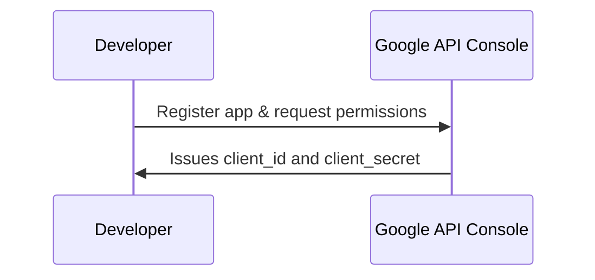

During this step:
- The developer registers CalendarBuddy with Google's API Console
- They specify app details and requested permissions
- Google provides a `client_id` (public identifier) and `client_secret` (confidential)

### 2. User Access Attempt 🔑

When you try to use CalendarBuddy to access your Google Calendar data:

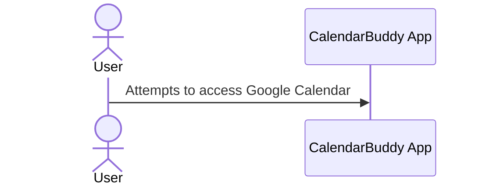

### 3. Authorization Server Redirect 🔄

CalendarBuddy redirects you to Google's authorization page:

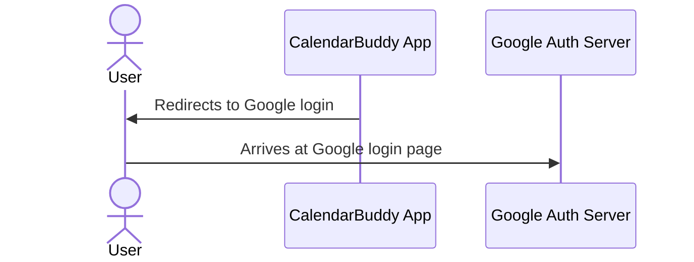

The authorization URL includes several important parameters:
```text
https://accounts.google.com/o/oauth2/v2/auth?
  client_id=123456789-abcdefghijklmnop.apps.googleusercontent.com&
  redirect_uri=https://calendarbuddy.com/auth/google/callback&
  response_type=code&
  scope=https://www.googleapis.com/auth/calendar.readonly&
  state=xyzABC123
```

### 4. User Authentication 👤

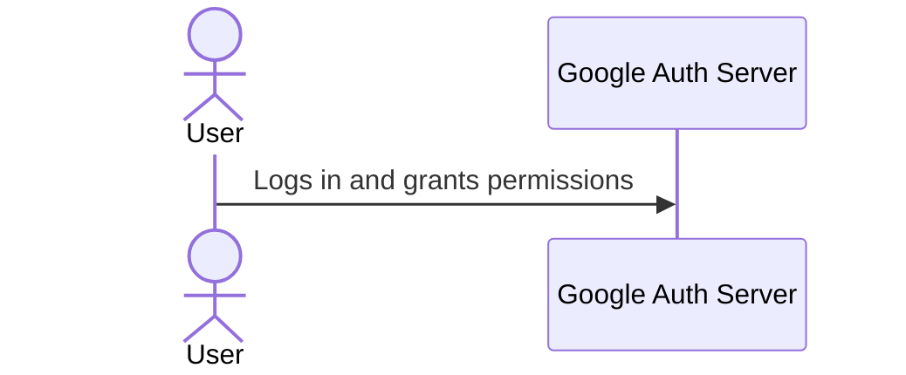

You log into your Google account and approve the requested permissions.

### 5. Authorization Code Issuance 📨

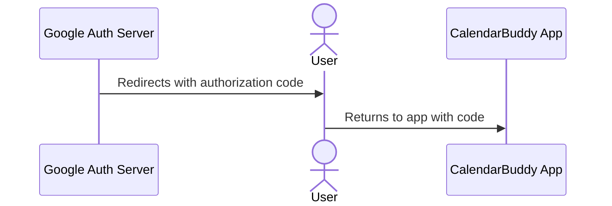

Google redirects back to CalendarBuddy with an authorization code:
```
https://calendarbuddy.com/auth/google/callback?
  code=4/P7q7W91a-oMsCeLvIaQm6bTrgtp7&
  state=xyzABC123
```

### 6. Token Exchange 🔄

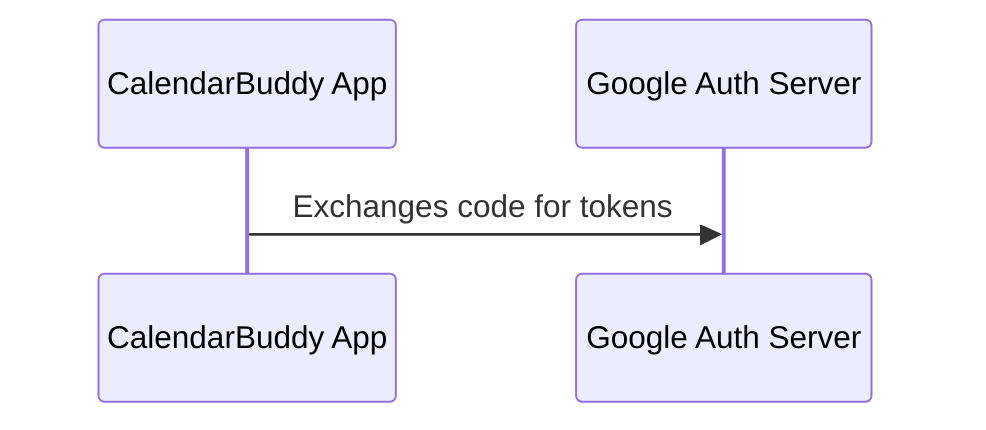

CalendarBuddy exchanges the authorization code for tokens:
```http
POST https://oauth2.googleapis.com/token
Content-Type: application/x-www-form-urlencoded
```

```shell
code=4/P7q7W91a-oMsCeLvIaQm6bTrgtp7&
client_id=123456789-abcdefghijklmnop.apps.googleusercontent.com&
client_secret=CLIENTSECRETxxxxxxxxxxx&
redirect_uri=https://calendarbuddy.com/auth/google/callback&
grant_type=authorization_code
```

### 7. Token Response 🎁

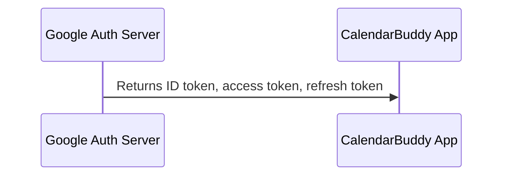

Google returns three important tokens:

1. **ID Token** (JWT format) containing user information:
```json
{
  "iss": "https://accounts.google.com",
  "azp": "123456789-abcdefghijklmnop.apps.googleusercontent.com",
  "aud": "123456789-abcdefghijklmnop.apps.googleusercontent.com",
  "sub": "10769150350006150715113082367",
  "email": "user@example.com",
  "email_verified": true,
  "name": "John Doe",
  // ... additional claims
}
```

2. **Access Token** (for API access)
3. **Refresh Token** (for obtaining new access tokens)

### 8. ID Token Processing 🔍

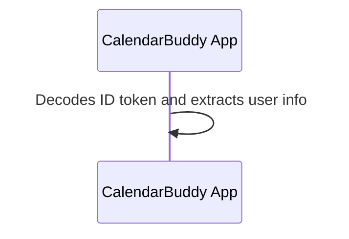

CalendarBuddy decodes the ID token to get user information.

### 9. Resource Request 📊

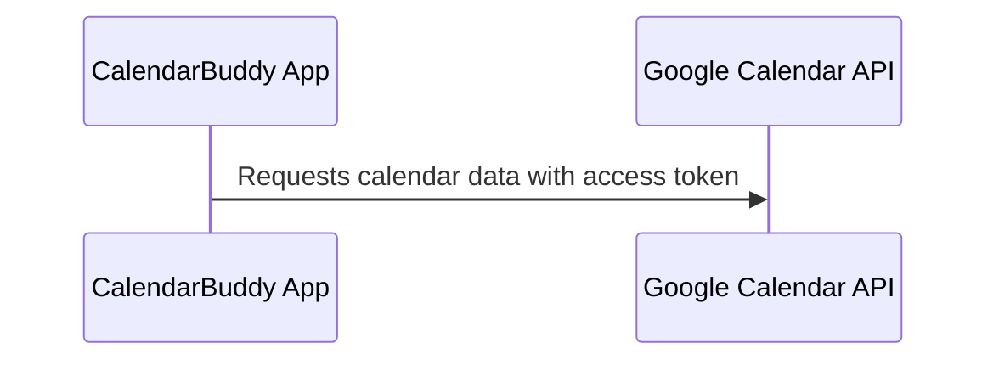

### 10. Resource Response 📅

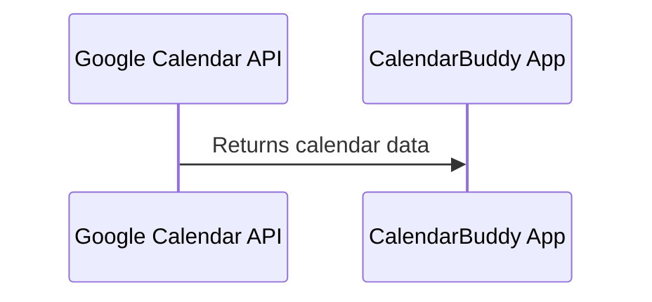

### 11. Display Data 🎯

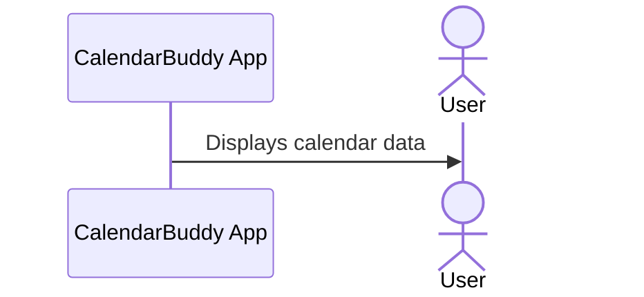

# Security Considerations 🛡️

## 1. State Parameter & CSRF Protection 🔒

The `state` parameter serves as a crucial security measure against CSRF attacks. It should be cryptographically secure and unique per request:

```typescript
interface AuthState {
  state: string;
  codeVerifier: string;
  nonce: string;
  createdAt: number;
}

class AuthStateManager {
  private static readonly STATE_TIMEOUT = 10 * 60 * 1000; // 10 minutes

  static generateState(): AuthState {
    return {
      state: crypto.randomBytes(32).toString('hex'),
      codeVerifier: crypto.randomBytes(32).toString('base64url'),
      nonce: crypto.randomBytes(16).toString('hex'),
      createdAt: Date.now()
    };
  }

  static validateState(stored: AuthState, received: string): boolean {
    const isExpired = Date.now() - stored.createdAt > this.STATE_TIMEOUT;
    return !isExpired && stored.state === received;
  }
}
```

## 2. PKCE Implementation 📱

PKCE is mandatory for public clients and recommended for all OAuth2 flows:

```typescript
class PKCEGenerator {
  static async generateChallenge(verifier: string): Promise<string> {
    const encoder = new TextEncoder();
    const data = encoder.encode(verifier);
    const hash = await crypto.subtle.digest('SHA-256', data);
    return btoa(String.fromCharCode(...new Uint8Array(hash)))
      .replace(/\+/g, '-')
      .replace(/\//g, '_')
      .replace(/=+$/, '');
  }
}

interface PKCEParams {
  codeVerifier: string;
  codeChallenge: string;
  codeChallengeMethod: 'S256';
}

async function generatePKCE(): Promise<PKCEParams> {
  const codeVerifier = crypto.randomBytes(32).toString('base64url');
  const codeChallenge = await PKCEGenerator.generateChallenge(codeVerifier);
  
  return {
    codeVerifier,
    codeChallenge,
    codeChallengeMethod: 'S256'
  };
}
```

## 3. Token Storage Strategy 🔐

Define clear interfaces and implement secure storage patterns:

```typescript
interface TokenSet {
  accessToken: string;
  refreshToken?: string;
  idToken?: string;
  expiresAt: number;
  scope: string[];
}

class TokenStorage {
  private static readonly REFRESH_TOKEN_COOKIE = 'auth.rt';
  
  static storeTokens(tokens: TokenSet): void {
    // Store access token in memory
    sessionStorage.setItem('auth.at', tokens.accessToken);
    
    // Store refresh token in HTTP-only cookie
    if (tokens.refreshToken) {
      document.cookie = `${this.REFRESH_TOKEN_COOKIE}=${tokens.refreshToken}; HttpOnly; Secure; SameSite=Strict; Path=/`;
    }
  }

  static clearTokens(): void {
    sessionStorage.removeItem('auth.at');
    document.cookie = `${this.REFRESH_TOKEN_COOKIE}=; Max-Age=0; Path=/`;
  }
}
```

## 4. HTTPS Configuration 🌐

Example using Express with TypeScript:

```typescript
import express from 'express';
import helmet from 'helmet';

interface SecurityConfig {
  strictTransportSecurity: boolean;
  forceHttps: boolean;
}

class SecurityMiddleware {
  static configure(app: express.Application, config: SecurityConfig): void {
    // Enable Helmet security headers
    app.use(helmet());
    
    if (config.strictTransportSecurity) {
      app.use(helmet.hsts({
        maxAge: 31536000,
        includeSubDomains: true,
        preload: true
      }));
    }

    if (config.forceHttps) {
      app.use((req, res, next) => {
        if (!req.secure) {
          return res.redirect(301, `https://${req.headers.host}${req.url}`);
        }
        next();
      });
    }
  }
}
```

## 5. Scope Management 📋

Implement structured scope handling:

```typescript
type ScopeType = 'read' | 'write' | 'delete';

interface Scope {
  name: string;
  type: ScopeType;
  description: string;
}

class ScopeManager {
  private static readonly SCOPES: Record<string, Scope> = {
    'calendar.read': {
      name: 'calendar.read',
      type: 'read',
      description: 'View calendar events'
    },
    'calendar.write': {
      name: 'calendar.write',
      type: 'write',
      description: 'Create and edit calendar events'
    }
  };

  static validateScopes(requestedScopes: string[]): string[] {
    return requestedScopes.filter(scope => 
      this.SCOPES[scope] && this.isPermitted(scope)
    );
  }

  static getMinimalScopes(): string[] {
    return Object.keys(this.SCOPES)
      .filter(scope => this.SCOPES[scope].type === 'read');
  }
}
```

# Best Practices 💡

## 1. ID Token Validation ✅

Implement comprehensive token validation:

```typescript
interface IDTokenClaims {
  iss: string;
  sub: string;
  aud: string;
  exp: number;
  iat: number;
  nonce?: string;
  auth_time?: number;
}

class TokenValidator {
  private readonly validIssuers: string[];
  private readonly clientId: string;

  constructor(issuers: string[], clientId: string) {
    this.validIssuers = issuers;
    this.clientId = clientId;
  }

  async validateIdToken(token: string, nonce?: string): Promise<IDTokenClaims> {
    const decoded = jwt.verify(token, await this.getPublicKey()) as IDTokenClaims;
    
    if (!this.validIssuers.includes(decoded.iss)) {
      throw new Error('Invalid token issuer');
    }
    
    if (decoded.aud !== this.clientId) {
      throw new Error('Invalid token audience');
    }
    
    if (nonce && decoded.nonce !== nonce) {
      throw new Error('Invalid token nonce');
    }
    
    if (Date.now() >= decoded.exp * 1000) {
      throw new Error('Token expired');
    }

    return decoded;
  }
}
```

## 2. Refresh Token Handling 🔄

Implement proactive token refresh:

```typescript
interface RefreshParams {
  minValidity: number;
  maxRetries: number;
}

class TokenRefresher {
  private isRefreshing = false;
  private refreshQueue: Array<(token: string) => void> = [];

  async refreshAccessToken(params: RefreshParams): Promise<string> {
    if (this.isRefreshing) {
      return new Promise(resolve => this.refreshQueue.push(resolve));
    }

    try {
      this.isRefreshing = true;
      const newToken = await this.performRefresh();
      
      // Resolve all queued promises
      this.refreshQueue.forEach(resolve => resolve(newToken));
      this.refreshQueue = [];
      
      return newToken;
    } finally {
      this.isRefreshing = false;
    }
  }

  private async performRefresh(): Promise<string> {
    // Implementation of token refresh logic
  }
}
```

## 3. Error Handling ⚠️

Create a structured error handling system:

```typescript
enum OAuthErrorCode {
  INVALID_REQUEST = 'invalid_request',
  INVALID_CLIENT = 'invalid_client',
  INVALID_GRANT = 'invalid_grant',
  UNAUTHORIZED_CLIENT = 'unauthorized_client',
  INVALID_TOKEN = 'invalid_token',
  INSUFFICIENT_SCOPE = 'insufficient_scope'
}

interface OAuthError {
  code: OAuthErrorCode;
  description?: string;
  uri?: string;
}

class OAuthErrorHandler {
  static async handleError(error: OAuthError): Promise<void> {
    switch (error.code) {
      case OAuthErrorCode.INVALID_TOKEN:
        await this.handleInvalidToken();
        break;
        
      case OAuthErrorCode.INVALID_GRANT:
        await this.handleInvalidGrant();
        break;
        
      default:
        this.logError(error);
        throw new Error('Unhandled OAuth error');
    }
  }

  private static async handleInvalidToken(): Promise<void> {
    // Implementation
  }
}
```

## 4. Token Expiration Management ⏰

Implement a token monitoring system:

```typescript
interface TokenMonitorConfig {
  refreshThreshold: number;
  checkInterval: number;
}

class TokenMonitor {
  private timer?: NodeJS.Timeout;
  
  constructor(private config: TokenMonitorConfig) {}

  startMonitoring(): void {
    this.timer = setInterval(() => {
      this.checkTokenExpiration();
    }, this.config.checkInterval);
  }

  private async checkTokenExpiration(): Promise<void> {
    const token = await TokenStorage.getAccessToken();
    const decodedToken = jwt.decode(token) as { exp: number };
    
    const timeUntilExpiry = (decodedToken.exp * 1000) - Date.now();
    if (timeUntilExpiry < this.config.refreshThreshold) {
      await this.refreshToken();
    }
  }
}
```

## 5. Secure Logout Process 🚪

Implement a comprehensive logout:

```typescript
interface LogoutOptions {
  revokeTokens: boolean;
  endSession: boolean;
  redirectUri?: string;
}

class LogoutManager {
  static async logout(options: LogoutOptions): Promise<void> {
    try {
      if (options.revokeTokens) {
        await this.revokeTokens();
      }

      if (options.endSession) {
        await this.endSession();
      }

      TokenStorage.clearTokens();
      
      if (options.redirectUri) {
        window.location.href = options.redirectUri;
      }
    } catch (error) {
      // Ensure tokens are cleared even if revocation fails
      TokenStorage.clearTokens();
      throw error;
    }
  }

  private static async revokeTokens(): Promise<void> {
    const tokens = await TokenStorage.getAllTokens();
    await Promise.all([
      this.revokeToken(tokens.accessToken),
      tokens.refreshToken && this.revokeToken(tokens.refreshToken)
    ]);
  }
}
```

## Conclusion 🎉

OAuth 2.0 and OIDC provide a secure and standardized way for applications to authenticate users and access their resources. By following these protocols, developers can implement secure authentication while providing a seamless user experience.
